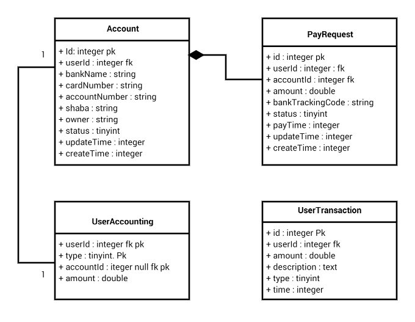

How to install this module:

Step1: First add flowing codes into project `composer.json`

```
"repositories": [
    {
        "type": "gitlab",
        "url": "https://gitlab.com/aminkt/yii2-userAccounting-module"
    }
],
```

Then add flowing line to require part of `composer.json` :
```
"aminkt/yii2-userAccounting-module": "*",
```

And after that run bellow command in your composer :
```
Composer update aminkt/yii2-userAccounting-module
```

Step2: Add flowing lines in your application admin config:

```
'userAccounting' => [
    'class' => 'userAccounting\UserAccounting',
    'controllerNamespace' => 'userAccounting\controllers\admin',
],
```

Step3: Add flowing lines in your application frontend config:

```
'userAccounting' => [
    'class' => 'userAccounting\UserAccounting',
    'controllerNamespace' => 'userAccounting\controllers\panel',
],
```


Structure of tables and classes:

